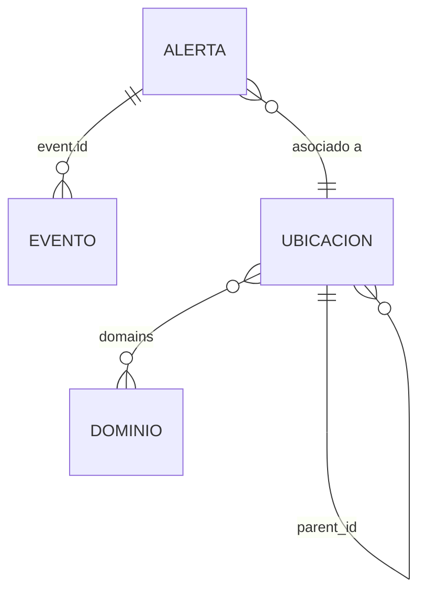

# 🍃 AgroAlerta Perú - Configuración de Base de Datos

> [!IMPORTANT]
> Este repositorio contiene la infraestructura lógica de datos para el sistema **AgroAlerta**. El script `setup.js` es la pieza fundamental para inicializar el entorno de base de datos MongoDB.

Este documento detalla el proceso de configuración, inicialización y la estructura de la base de datos **MongoDB Atlas**. El script proporcionado se encarga de:
- ✅ Aprovisionar colecciones estructuradas.
- ⚡ Establecer índices de alto rendimiento.
- 📚 Poblar catálogos maestros para el sistema de alertas.

---

## ☁️ 1. Despliegue en MongoDB Atlas

MongoDB Atlas es el motor en la nube que sustenta nuestra plataforma. Sigue estos pasos para preparar tu entorno:

1.  **Crear un Cluster:**
    - Inicia sesión en [MongoDB Atlas](https://www.mongodb.com/cloud/atlas).
    - Despliega un clúster gratuito (*M0 Sandbox*).
2.  **Configurar el Acceso de Red (Network Access):**
    - Ve a `Network Access` -> **Add IP Address**.
    - > [!TIP]
      > Para desarrollo rápido, usa **Allow Access from Anywhere** (`0.0.0.0/0`).
3.  **Crear Usuario de Base de Datos:**
    - Ve a `Database Access` -> **Add New Database User**.
    - Asigna el rol **Read and write to any database**.
4.  **Obtener la Cadena de Conexión:**
    - Haz clic en **Connect** -> **Compass**.
    - Copia la URL: `mongodb+srv://<user>:<password>@cluster.xxxxx.mongodb.net/`

---

## 🖥️ 2. Ejecución del Setup via MongoDB Compass

MongoDB Compass permite interactuar visualmente con los datos.

1.  **Conexión:**
    - Abre Compass y pega tu cadena de conexión.
    - Especifica la base de datos: `...mongodb.net/agro_alerta_db`.
2.  **Ejecutar el Script de Inicialización:**
    - Abre la terminal integrada **>_ MONGOSH** en la parte inferior.
    - Copia el contenido de `setup.js` y pégalo en la terminal.
    - Presiona **Enter** y confirma los mensajes de éxito `{ ok: 1 }`.

> [!NOTE]
> Una vez ejecutado, verás en el panel izquierdo las colecciones: `locations`, `official_sources`, `domains`, `crops`, `events` y `documents_risk_alerts`.

---

## 🗄️ 3. Diccionario de Datos y Colecciones

El modelo de datos separa la data transaccional (alertas) de los catálogos maestros.

### Relaciones del Sistema


---

### 🚨 `documents_risk_alerts`
Almacena las alertas climáticas y documentos de riesgo.

| Campo | Tipo | Descripción |
| :--- | :--- | :--- |
| `_id` | `ObjectId` | Identificador único del documento. |
| `risk` | `String` | Nivel de riesgo (ej. `ALTO`, `MEDIO`). |
| `event` | `Object` | Objeto anidado del evento. |
| `event.id` | `String` | Referencia a `events._id`. |
| `risk_date` | `Date` | Fecha y hora exacta de la alerta. |

<details>
<summary><b>Ver ejemplo JSON</b></summary>

```json
{
  "_id": "64b1f...",
  "risk": "ALTO",
  "event": { "id": "lluvia_fuerte" },
  "risk_date": "2023-10-27T10:00:00Z"
}
```
</details>

---

### 📍 `locations`
Catálogo maestro de ubicaciones geográficas.

| Campo | Tipo | Descripción |
| :--- | :--- | :--- |
| `_id` | `UUID` | ID único (String). |
| `parent_id` | `UUID` | Referencia al `_id` superior. |
| `name` | `String` | Nombre (ej. "Arequipa"). |
| `type` | `String` | `PAIS`, `DEPARTAMENTO`, `PROVINCIA`. |
| `ubigeo` | `Number` | Código estándar nacional. |
| `domains` | `Array` | IDs de la colección `domains`. |
| `meta_info` | `Object` | Coordenadas y zoom para mapas. |

---

### 🏢 `official_sources`
Entidades de donde provienen los datos.

| Campo | Tipo | Descripción |
| :--- | :--- | :--- |
| `_id` | `String` | Abreviatura (ej. `SENAMHI`). |
| `name` | `String` | Nombre completo institucional. |
| `url` | `String` | Enlace oficial. |

---

### 🌍 `domains`
Macrorregiones climáticas (ej. Costa Norte).

| Campo | Tipo | Descripción |
| :--- | :--- | :--- |
| `_id` | `Number` | ID numérico (1-7). |
| `name` | `String` | Nombre corto. |
| `is_active`| `Boolean`| Estado del registro. |

---

### 🌽 `crops` | 🌦️ `events`
| Colección | Descripción | Ejemplo de Campos |
| :--- | :--- | :--- |
| **Crops** | Tipos de cultivos. | `name`, `category`, `is_active` |
| **Events** | Fenómenos climáticos. | `name`, `emoji`, `is_active` |

---


## ⚡ 4. Índices de Rendimiento

Los índices son el motor de búsqueda que garantiza respuestas instantáneas incluso con millones de registros históricos.

| Índice | Dirección | Impacto en la Aplicación |
| :--- | :---: | :--- |
| `risk` | `1` (ASC) | **Dashboard:** Filtros rápidos por severidad (Crítico, Medio). |
| `event.id` | `1` (ASC) | **Reportes:** Búsqueda instantánea por tipo de fenómeno (Heladas, Sequías). |
| `risk_date` | `-1` (DESC) | **Feed:** Carga inmediata de las últimas alertas detectadas. |

---

> [!NOTE]
> Estos índices se crean automáticamente al ejecutar el script `setup.js`. Puedes verificar su estado en la pestaña **Indexes** de MongoDB Compass dentro de la colección `documents_risk_alerts`.
